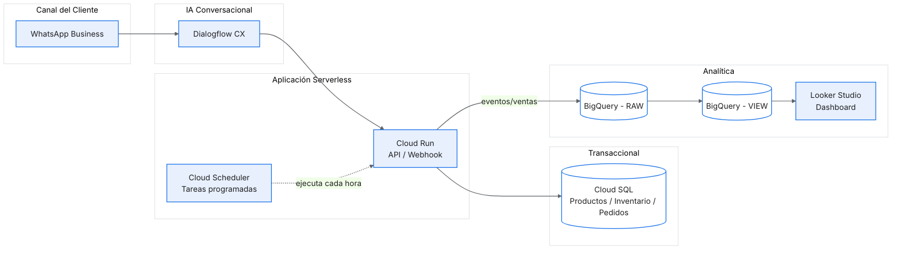

# Proyecto Final - Ingeniería de Datos e IA con GCP

## **Caso de estudio**
Tienda virtual multi-categoría que vende productos tecnológicos, juguetes,
motocicletas y maquillaje. Tiene plataforma eCommerce funcional con control de stock

## **Problema**
Actualmente tengo una plataforma eCommerce que funciona bien, pero el control de
inventario es completamente MANUAL. Cada día debo:
• Entrar a la web del eCommerce, iniciar sesión
• Revisar producto por producto para ver el stock actual
• Anotar manualmente cuáles productos están bajos
• Cuando un cliente pregunta por WhatsApp, debo buscar en la web y responder manualmente
• Para decidir qué comprar, no tengo predicciones, decido 'a ojo'
Tiempo invertido: En consultas y verificación de productos se invierte diariamente entre 2-3
horas diarias aproximadamente.

## **Solución Propuesta**
Automatizar el control de inventario usando servicios de Google Cloud Platform (GCP)
para que el sistema trabaje 24/7 sin mi intervención. El sistema hará:
• Verificar automáticamente el stock cada hora (sin que yo entre a la web)
• Enviar alertas a WhatsApp cuando un producto esté bajo: 'iPhone 15: Stock 3/10'
• Predecir con IA cuánto se venderá: 'Venderás 18 labiales este mes, pide 20 unidades'
• Responder automáticamente a clientes en WhatsApp: '¿Tienes iPhone? ® Sí, 5 unidades'
• Mostrar dashboards con ventas, stock y predicciones actualizados en tiempo real

## **Servicios GCP Utilizados**
1. Cloud SQL
Base de datos centralizada. Complementa o conecta con tu eCommerce actual para centralizar datos.
2. Cloud Scheduler
Programador automático. Activa tareas cada hora sin intervención manual.
3. Cloud Functions
Código que ejecuta las tareas: verificar stock, enviar alertas, sincronizar datos.
4. BigQuery
Almacén de datos. Guarda histórico de ventas e inventario para análisis.
5. Vertex AI
Inteligencia Artificial. Predice demanda futura basándose en histórico de ventas.
6. Dialogflow CX
Chatbot para WhatsApp. Responde automáticamente consultas de disponibilidad.
7. Looker Studio
Dashboards visuales. Muestra métricas actualizadas en tiempo real.

## 🗺️ Diagrama de Arquitectura GCP

