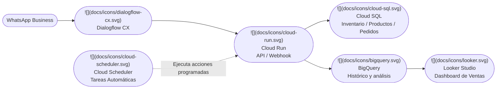

# Proyecto Final - Ingeniería de Datos e IA con GCP

## **Arquitectura del Caso: Automatización de Ecommerce + WhatsApp**

## 🗺️ Diagrama de Arquitectura (con íconos oficiales de GCP)

```mermaid
flowchart LR

  %% ==== Nodos con imágenes ====
  WAB(["WhatsApp Business"])

  CX(["![](docs/icons/dialogflow-cx.svg)<br/>Dialogflow CX"])

  RUN(["![](docs/icons/cloud-run.svg)<br/>Cloud Run<br/>API / Webhook"])

  SQL(["![](docs/icons/cloud-sql.svg)<br/>Cloud SQL<br/>Inventario / Productos / Pedidos"])

  BQ(["![](docs/icons/bigquery.svg)<br/>BigQuery<br/>Histórico y análisis"])

  LOOKER(["![](docs/icons/looker.svg)<br/>Looker Studio<br/>Dashboard de Ventas"])

  SCH(["![](docs/icons/cloud-scheduler.svg)<br/>Cloud Scheduler<br/>Tareas Automáticas"])

  %% ==== Flujo del sistema ====
  WAB --> CX
  CX --> RUN
  RUN --> SQL
  RUN --> BQ
  BQ --> LOOKER
  SCH -. Ejecuta acciones programadas .-> RUN

```
