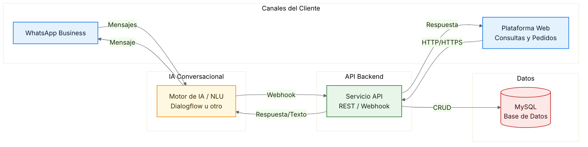
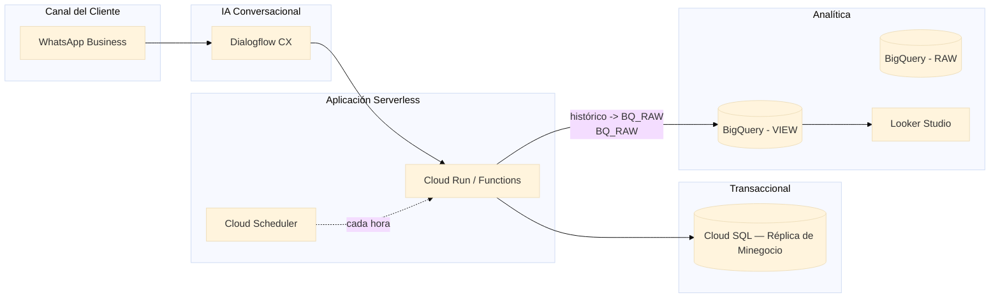
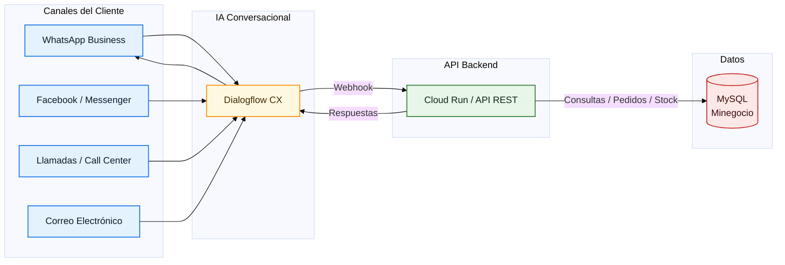
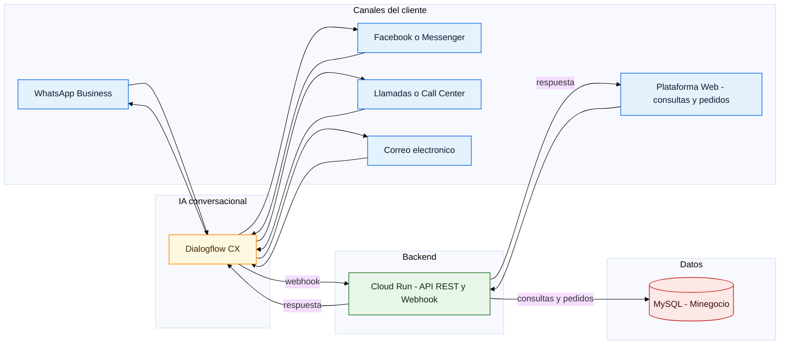
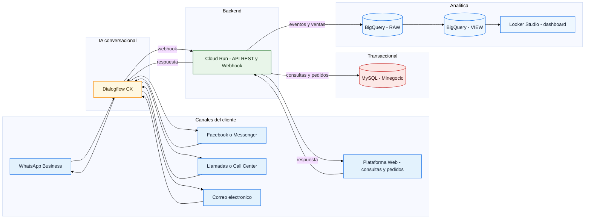

# Proyecto Final - Ingeniería de Datos e IA con GCP

## **Caso de estudio**
Tienda virtual multi-categoría que vende productos tecnológicos, juguetes, motocicletas y maquillaje. Cuenta con una plataforma eCommerce funcional con control de stock y canales de atención: WhatsApp Business, Facebook/Messenger, Llamadas, Correo y Web.

## **Problema**
Actualmente la plataforma eCommerce funciona, pero el control de inventario es manual. Cada día debo:
* Entrar a la web del eCommerce e iniciar sesión.
* Revisar producto por producto para ver el stock actual.
* Anotar manualmente cuáles productos están bajos.
* Cuando un cliente pregunta por WhatsApp, Facebook o correo, buscar en la web y responder manualmente.
* Para decidir compras, no hay predicciones; las decisiones son a ojo.

Tiempo invertido: entre 2–3 horas diarias en consultas y verificación de productos.

## **Solución Propuesta**
Automatizar el control de inventario usando servicios de Google Cloud Platform (GCP)
para que el sistema trabaje 24/7 sin mi intervención. El sistema hará:
• Verificar automáticamente el stock cada hora (sin que yo entre a la web)
• Enviar alertas a WhatsApp cuando un producto esté bajo: 'iPhone 15: Stock 3/10'
• Predecir con IA cuánto se venderá: 'Venderás 18 labiales este mes, pide 20 unidades'
• Responder automáticamente a clientes en WhatsApp: '¿Tienes iPhone? ® Sí, 5 unidades'
• Mostrar dashboards con ventas, stock y predicciones actualizados en tiempo real

## **Servicios GCP Utilizados**
1. Cloud SQL
Base de datos centralizada. Complementa o conecta con tu eCommerce actual para centralizar datos.
2. Cloud Scheduler
Programador automático. Activa tareas cada hora sin intervención manual.
3. Cloud Functions
Código que ejecuta las tareas: verificar stock, enviar alertas, sincronizar datos.
4. BigQuery
Almacén de datos. Guarda histórico de ventas e inventario para análisis.
5. Vertex AI
Inteligencia Artificial. Predice demanda futura basándose en histórico de ventas.
6. Dialogflow CX
Chatbot para WhatsApp. Responde automáticamente consultas de disponibilidad.
7. Looker Studio
Dashboards visuales. Muestra métricas actualizadas en tiempo real.

## 🗺️ Diagrama de Arquitectura Actual - AS IS

## 🗺️ Diagrama de Arquitectura GCP - TO BE

## Flujo Actual con Múltiples Canales de Atención

## **Descripción del Funcionamiento**
## **Flujo 1: Monitoreo Automático**
  1. Cloud Scheduler activa cada hora (ej: 8am, 9am, 10am...)
  2. Cloud Function lee stock de todos los productos
  3. Si detecta stock_actual < stock_minimo ® Guarda en BigQuery
  4. Envía mensaje WhatsApp: 'nn Labial Maybelline: 3 unidades (mínimo: 8)'
  5. Dashboard Looker se actualiza automáticamente
## **Flujo 2: Predicción de Demanda**
  1. Cada noche a las 11pm, Cloud Scheduler activa análisis
  2. Cloud Function extrae histórico de ventas (últimos 12 meses)
  3. Vertex AI analiza y predice: 'Venderás 23 labiales próximo mes'
  4. Calcula: 23 - 3 (stock actual) = 20 ® 'Pide 20 unidades'
  5. Guarda recomendación en BigQuery
## **Flujo 3: Atención Cliente WhatsApp**
  1. Cliente: '¿Tienes iPhone 15?'
  2. Dialogflow CX procesa pregunta
  3. Cloud Function consulta stock en base de datos
  4. Bot responde: 'Sí, tenemos 5 unidades a S/. 4,500'
  5. Todo en 2 segundos, sin intervención manual
