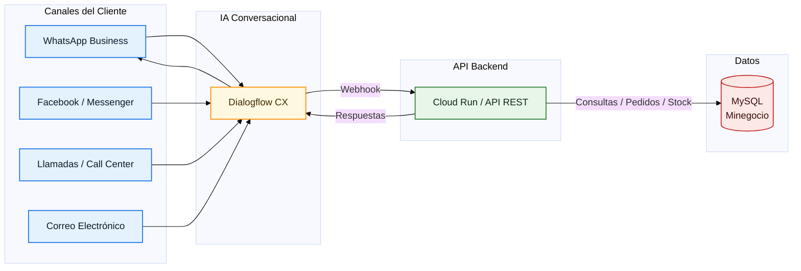
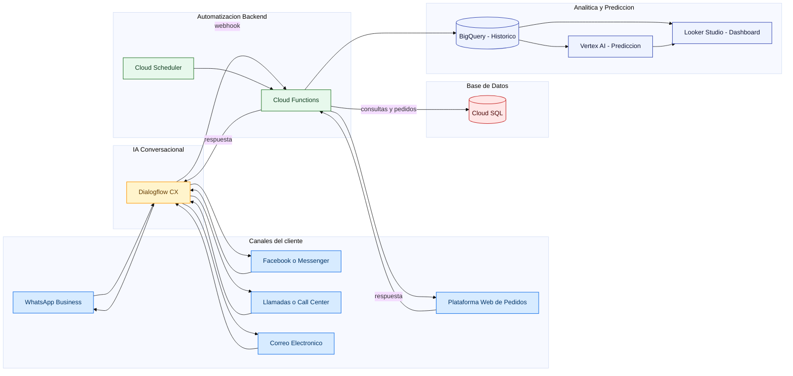

# Proyecto Final - Ingeniería de Datos e IA con GCP

## **Caso de estudio**
Tienda virtual multi-categoría que vende productos tecnológicos, juguetes, motocicletas y maquillaje. Cuenta con una plataforma eCommerce funcional con control de stock y canales de atención: WhatsApp Business, Facebook/Messenger, Llamadas, Correo y Web.

## **Problema**
Actualmente la plataforma eCommerce funciona, pero el control de inventario es manual. Cada día debo:
* Entrar a la web del eCommerce e iniciar sesión.
* Revisar producto por producto para ver el stock actual.
* Anotar manualmente cuáles productos están bajos.
* Cuando un cliente pregunta por WhatsApp, Facebook o correo, buscar en la web y responder manualmente.
* Para decidir compras, no hay predicciones; las decisiones son a ojo.

Tiempo invertido: entre 2–3 horas diarias en consultas y verificación de productos.

## **Solución Propuesta**
Automatizar el control de inventario usando servicios de Google Cloud Platform (GCP)
* para que el sistema trabaje 24/7 sin mi intervención. El sistema hará:
* Verificación automática de stock cada hora y por evento.
* Alertas a los canales internos (p. ej., WhatsApp) cuando un producto esté bajo: “iPhone 15 – Stock 3/10”.
* Predicción con IA de ventas por categoría y SKU: “Se proyectan 18 labiales este mes; reponer 20 unidades”.
* Atención automática multicanal (WhatsApp, Facebook/Messenger, correo, llamadas IVR) con IA para consultas de disponibilidad, precio y estado de pedido.
* Dashboards en tiempo real con ventas, stock y proyecciones.

## **Servicios GCP Utilizados**
1. Cloud SQL
Base de datos centralizada. Complementa o conecta con tu eCommerce actual para centralizar datos.
2. Cloud Scheduler
Programador automático. Activa tareas cada hora sin intervención manual.
3. Cloud Functions
Código que ejecuta las tareas: verificar stock, enviar alertas, sincronizar datos.
4. BigQuery
Almacén de datos. Guarda histórico de ventas e inventario para análisis.
5. Vertex AI
Inteligencia Artificial. Predice demanda futura basándose en histórico de ventas.
6. Dialogflow CX
Chatbot para WhatsApp. Responde automáticamente consultas de disponibilidad.
7. Looker Studio
Dashboards visuales. Muestra métricas actualizadas en tiempo real.

## 🗺️ Diagrama de Arquitectura Actual - AS IS

## 🗺️ Diagrama de Arquitectura GCP - TO BE

## **Descripción del Funcionamiento**
## **Flujo 1: Descripción del Funcionamiento (Actualizado Multicanal)**
  1. Cloud Scheduler activa la verificación automáticamente cada hora (ej: 8:00, 9:00, 10:00…).
  2. Cloud Functions consulta el inventario en Cloud SQL (Minegocio).
  3. Si encuentra productos con:
    stock_actual < stock_minimo
    → registra el evento en BigQuery (histórico).
  4. Cloud Functions envía una alerta automática al canal interno (WhatsApp Business).
  5. El Dashboard en Looker Studio se actualiza automáticamente.
## **Flujo 2: Predicción de Demanda (IA para reposición inteligente)**
  1. Cada noche a las 11:00 PM, Cloud Scheduler ejecuta el análisis de demanda.
  2. Cloud Functions extrae ventas históricas desde BigQuery (ej: últimos 12 meses).
  3. Vertex AI analiza el comportamiento de ventas y predice la demanda futura.
  4. Se calcula automáticamente la cantidad recomendada de reposición:
    demanda_predicha – stock_actual
  5. Se guarda la recomendación en BigQuery y se muestra en Looker Studi
## **Flujo 3: Atención Automática Multicanal (WhatsApp, Facebook, Llamadas, Correo y Web)**
  1. El cliente realiza una consulta desde cualquier canal:
      * WhatsApp Business
      * Facebook/Messenger
      * Llamada (IVR/Agente asistido)
      * Correo electrónico
      * Plataforma Web
  2. Dialogflow CX interpreta la intención del cliente (ej: consultar stock, precio, estado de pedido).
  3. Cloud Functions consulta la información en Cloud SQL (Minegocio).
  4. El bot responde automáticamente en el mismo canal donde el cliente inició la conversación.al
